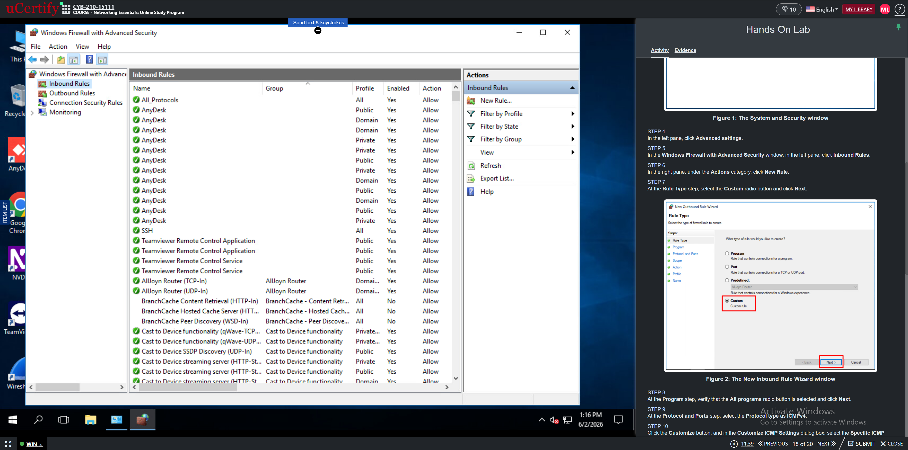
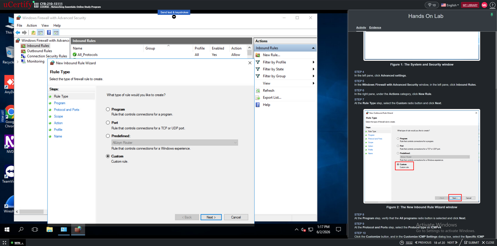
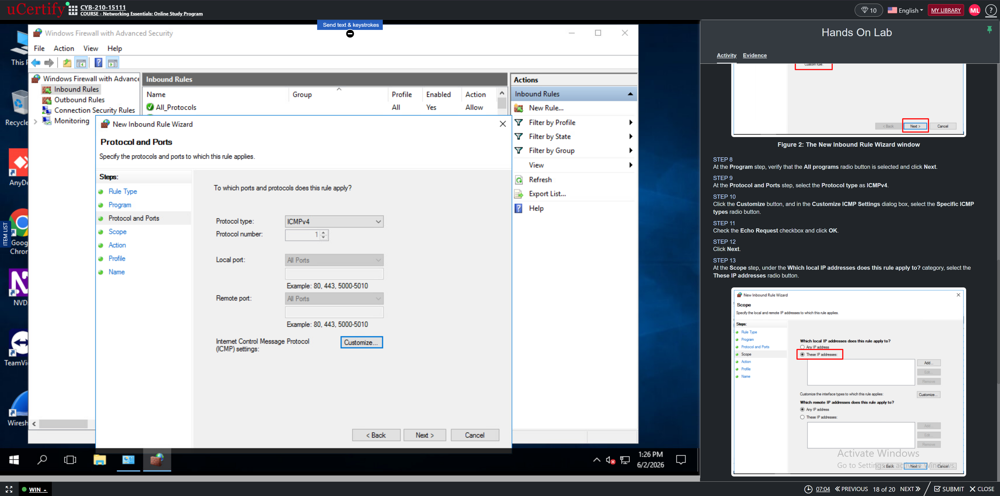
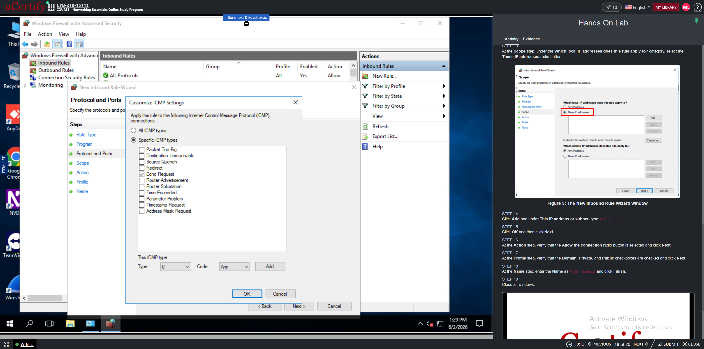
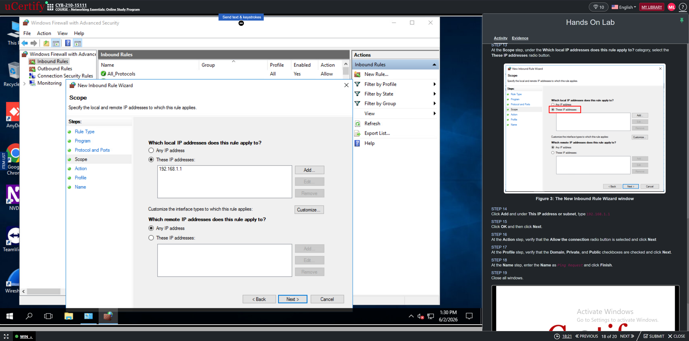
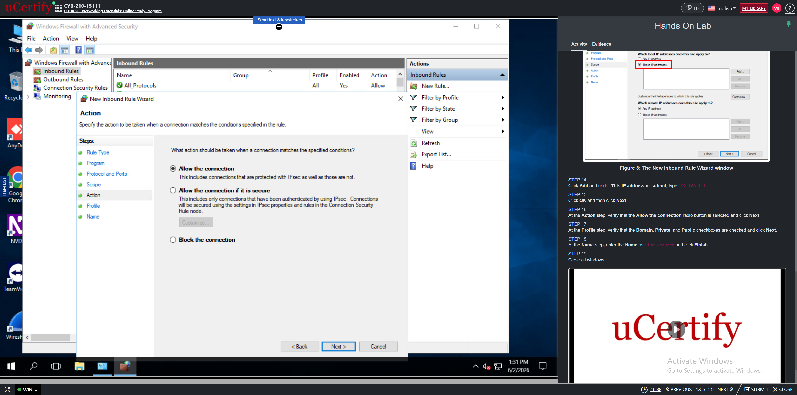
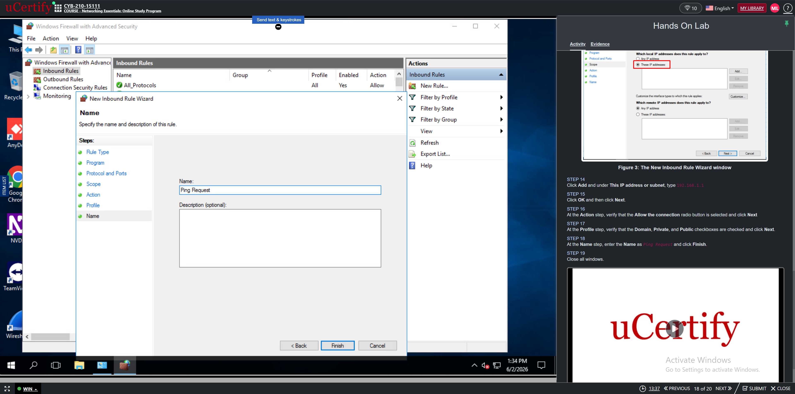
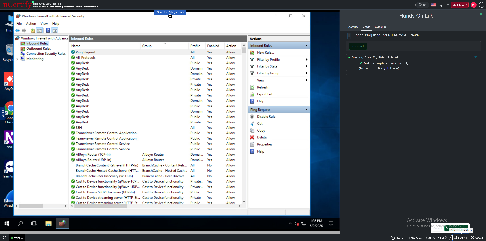

# Windows Firewall Inbound Rule Configuration Lab

## Project Overview
This project demonstrates how to configure inbound firewall rules using Windows Firewall with Advanced Security.

## Objective
Create an inbound rule that allows ICMPv4 Echo Request (Ping) traffic from a specific IP address.

## Tasks Performed
1. Opened Windows Firewall with Advanced Security.
2. Selected Inbound Rules.
3. Created a custom inbound rule.
4. Configured ICMPv4 protocol settings.
5. Enabled Echo Request.
6. Configured local IP scope.
7. Allowed the connection.
8. Applied Domain, Private, and Public profiles.
9. Named the rule "Ping Request".
10. Verified the inbound rule was created successfully.

## Skills Demonstrated
- Windows Firewall Administration
- Inbound Rule Configuration
- ICMPv4 Traffic Management
- Network Security
- Windows Security Controls

## Screenshots

## Screenshots

 ### 1. Lab Overview

### 2. Windows Firewall Status

### 3. Windows Firewall with Advanced Security

### 4. Inbound Rules Selected

### 5. New Rule - Custom

### 6. Protocol Type - ICMPv4

### 7. Customize ICMP Settings - Echo Request Checked

### 8. Scope Configuration

### 9. Action - Allow the Connection

### 10. Profile Selection

### 11. Rule Name - Ping Request

### 12. Completed Inbound Rule

